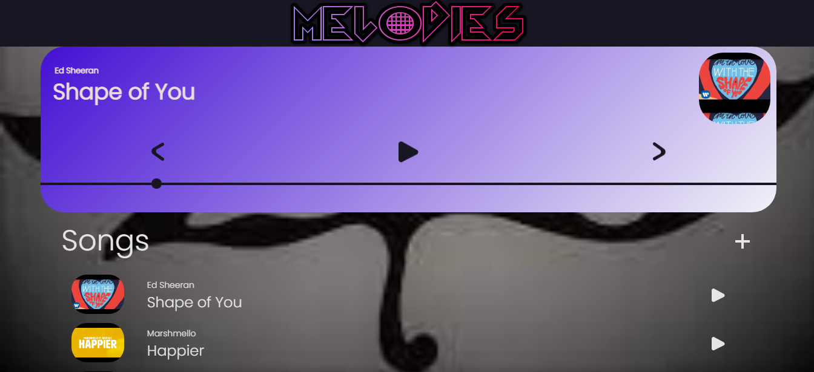

# </h2>
Listen to songs | Upload Songs | Realtime | Enjoy! |

  <b><i>Melodies Homepage</i></b>

 

<h2>Melodies</h2>

<h3>Listen and Upload Songs</h3>

Melodies is music web app where you can listen to your favourite songs and upload songs of your choice 
for others to enjoy. It is a realtime online app storing all songs thumbnails and artists in a realtime
database and cloud storage. Enjoy!

Check it out [here]( https://danieltk26.github.io/Melodies/)

 
<h3 align="center">Have a nice Day Ahead 😁😉 !!!</h3>

[gmail]: DanielTk999@gmail.com
[danielchats]: https://danieltk26.github.io/Daniel-Chats/
[roblox]: https://www.roblox.com/users/466671545/profile
[myweb]: https://danieltk26.github.io/Daniel-Thomas/index.html#hero
[grp]: https://https://github.com/Super-Teen-Coders
